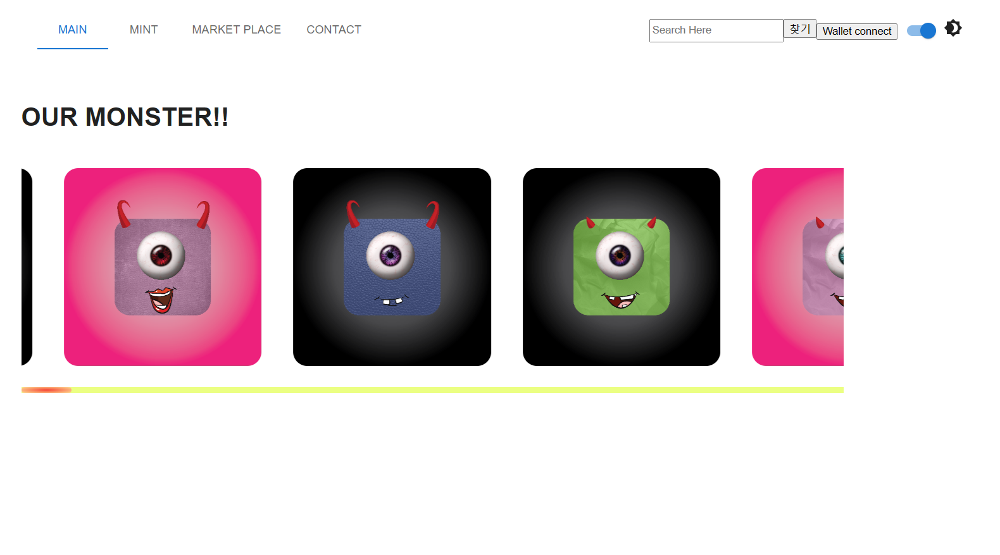

# 
**JuShoppingmall**

## Shoppingmall

### 기간 : 2022.10.21 ~ 2022.10.28

### 개발자 : 주병현

### 본인 역할

- **로그인**

  - Mysql을 이용한 로그인 구현
  
  - JWT를 이용한 로그인 유지

- **회원가입**

  - Mysql을 이용한 회원가입 구현

- ** Mysql설계 **

  - 로그인 : 로그인에 필요한 쇼핑몰 유저 저장

  - 회원가입 : 유입된 회원들을 저장할 수 있는 저장소 구현

  - 자유게시판 : 유저들이 자유롭게 글을 쓸 수 있는 게시판 구현
  
  - 댓글 : 유저들이 자유게시판에 있는 특정 글에 댓글을 달 수 있는 공간 구현
  
  - 장바구니 : 유저들이 마음에 드는 상품을 골라 담을 수 있는 저장공간 구현

- **프론트**

  - 로그인페이지

  - 회원가입 페이지

  - 자유게시판 페이지

  - 장바구니 페이지

---

## 목차

- [**개요**](https://github.com/acca3434/JuShoppingmall#%EA%B0%9C%EC%9A%94)
- [**사용기술**](https://github.com/acca3434/JuShoppingmall#%EC%82%AC%EC%9A%A9-%EA%B8%B0%EC%88%A0)
  - [전체 데이터베이스](https://github.com/acca3434/JuShoppingmall#%EC%A0%84%EC%B2%B4-%EB%8D%B0%EC%9D%B4%ED%84%B0%EB%B2%A0%EC%9D%B4%EC%8A%A4
)
  - [메인 페이지](https://github.com/acca3434/JuShoppingmall#%EB%A9%94%EC%9D%B8-%ED%8E%98%EC%9D%B4%EC%A7%80)
  - [회원가입 페이지](https://github.com/acca3434/JuShoppingmall#%ED%9A%8C%EC%9B%90%EA%B0%80%EC%9E%85-%ED%8E%98%EC%9D%B4%EC%A7%80)
  - [로그인 페이지](https://github.com/acca3434/JuShoppingmall#%EB%A1%9C%EA%B7%B8%EC%9D%B8-%ED%8E%98%EC%9D%B4%EC%A7%80)
  - [로그인 후 페이지](https://github.com/acca3434/JuShoppingmall#%EB%A1%9C%EA%B7%B8%EC%9D%B8-%ED%9B%84-%ED%8E%98%EC%9D%B4%EC%A7%80)
  - [자유게시판 페이지](https://github.com/acca3434/JuShoppingmall#%EC%9E%90%EC%9C%A0%EA%B2%8C%EC%8B%9C%ED%8C%90-%ED%8E%98%EC%9D%B4%EC%A7%80)
  - [자유게시판 검색 기능(JQeury)](https://github.com/acca3434/JuShoppingmall#%EC%9E%90%EC%9C%A0%EA%B2%8C%EC%8B%9C%ED%8C%90-%EA%B2%80%EC%83%89-%EA%B8%B0%EB%8A%A5jqeury)
  - [자유게시판 댓글 기능](https://github.com/acca3434/JuShoppingmall#%EC%9E%90%EC%9C%A0%EA%B2%8C%EC%8B%9C%ED%8C%90-%EB%8C%93%EA%B8%80-%EA%B8%B0%EB%8A%A5
)
  - [장바구니 기능](https://github.com/acca3434/JuShoppingmall#%EC%9E%A5%EB%B0%94%EA%B5%AC%EB%8B%88-%EA%B8%B0%EB%8A%A5)
  
---

## **개요**

### **Scripts**

#### client

`cd project`

npm start

#### backend

`cd backend`

npm start

---

## 사용 **기술**

 

 
 

 

---

### 전체 데이터베이스

 

 

### 메인 페이지

 

 

### 회원가입 페이지

 

 

### 로그인 페이지

 

 

### 로그인 후 페이지

 

 

### 자유게시판 페이지

 

 

### 자유게시판 검색 기능(JQeury)

 

 

### 자유게시판 댓글 기능

 

 

### 장바구니 기능

 

 
