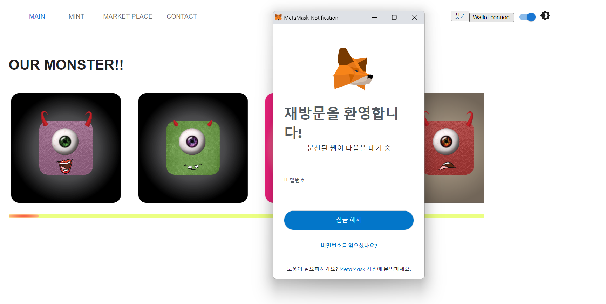
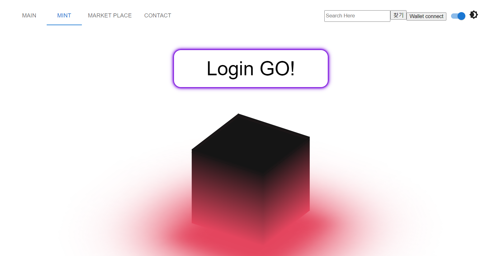
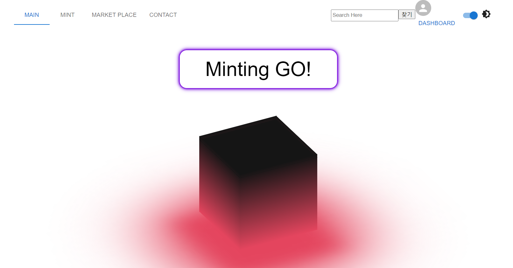
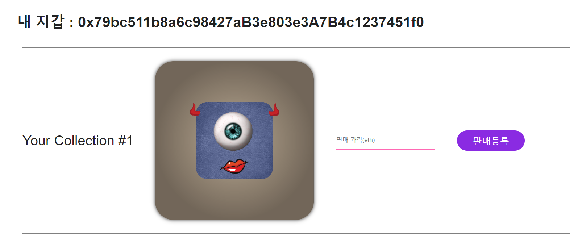

# <div align="center">**MonsterNFT**</div>

## MonsterNFT

### 기간 : 2022.12.20 ~ 2022.12.27

### 개발자 : 주병현,송화영,김경환

### 본인 역할

- **스마트 컨트랙트**

  - Solidity언어를 이용한 스마트 컨트랙트 제작
  
  - ERC721토큰 발급
  
  - Front View 와 메타마스크 연결작업

  - 1부터 60까지 랜덤으로 민팅하는 기능작성

- **프론트엔드**

  - 유저가 민팅한 ERC721토큰을 보여주는 마이페이지 제작

  - Web3.js를 이용한 메타마스크 연결

## 목차


- [**개요**](https://github.com/acca3434/MonsterNFT#%EA%B0%9C%EC%9A%94)
- [**사용기술**](https://github.com/acca3434/MonsterNFT#%EC%82%AC%EC%9A%A9-%EA%B8%B0%EC%88%A0)
  - [메인 페이지](https://github.com/acca3434/MonsterNFT#%EB%A9%94%EC%9D%B8-%ED%8E%98%EC%9D%B4%EC%A7%80)
  - [메타마스크 연결](https://github.com/acca3434/MonsterNFT#%EB%A9%94%ED%83%80%EB%A7%88%EC%8A%A4%ED%81%AC-%EC%97%B0%EA%B2%B0)
  - [로그인 이전 페이지](https://github.com/acca3434/MonsterNFT#%EB%A1%9C%EA%B7%B8%EC%9D%B8-%EC%9D%B4%EC%A0%84-%ED%8E%98%EC%9D%B4%EC%A7%80)
  - [로그인 후 페이지](https://github.com/acca3434/MonsterNFT#%EB%A1%9C%EA%B7%B8%EC%9D%B8-%ED%9B%84-%ED%8E%98%EC%9D%B4%EC%A7%80)
  - [마이페이지](https://github.com/acca3434/MonsterNFT#%EB%A7%88%EC%9D%B4-%ED%8E%98%EC%9D%B4%EC%A7%80)
  - [유저 NFT개수](https://github.com/acca3434/MonsterNFT#%EC%9C%A0%EC%A0%80%EA%B0%80-%EA%B0%80%EC%A7%80%EA%B3%A0-%EC%9E%88%EB%8A%94-nft%EB%AF%BC%ED%8C%85-%EA%B0%9C%EC%88%98%EB%A5%BC-%EB%B3%B4%EC%97%AC%EC%A3%BC%EB%8A%94-%EC%9C%A0%EC%A0%80-%EB%A7%88%EC%9D%B4%ED%8E%98%EC%9D%B4%EC%A7%80)
  - [판매등록](https://github.com/acca3434/MonsterNFT#%ED%8C%90%EB%A7%A4%EB%93%B1%EB%A1%9D-%ED%95%A0-%EC%88%98-%EC%9E%88%EB%8A%94-%EC%BB%A8%ED%8A%B8%EB%9E%99%ED%8A%B8-%EC%BD%94%EB%93%9C)
  - [구매등록](https://github.com/acca3434/MonsterNFT#%EC%9C%A0%EC%A0%80%EA%B0%80-%EB%8B%A4%EB%A5%B8-%EC%9C%A0%EC%A0%80%EC%9D%98-%ED%86%A0%ED%81%B0%EC%9D%84-%EA%B5%AC%EB%A7%A4%ED%95%A0-%EC%88%98-%EC%9E%88%EB%8F%84%EB%A1%9D-%ED%95%98%EB%8A%94-%EC%BB%A8%ED%8A%B8%EB%9E%99%ED%8A%B8-%EA%B5%AC%ED%98%84)
  - [다른 유저 NFT 판매리스트](https://github.com/acca3434/MonsterNFT#%EA%B7%B8%EB%A6%AC%EA%B3%A0-%EB%A7%88%EC%9D%B4%ED%8E%98%EC%9D%B4%EC%A7%80%EC%97%90%EC%84%9C-%EC%9C%A0%EC%A0%80%EA%B0%80-%ED%8C%90%EB%A7%A4%ED%95%98%EB%8A%94-%EC%A0%84%EC%B2%B4-%ED%8C%90%EB%A7%A4-%EB%A6%AC%EC%8A%A4%ED%8A%B8-%ED%99%95%EC%9D%B8)
- [힘든점 및 이슈발생](https://github.com/acca3434/MonsterNFT#%ED%9E%98%EB%93%A4%EC%97%88%EB%8D%98%EC%A0%90)
---

## **개요**

### **실행 순서**

#### client

`cd front`

npm start

---

## 사용 **기술**

 

 

 
 
 
 

---

## 메인 페이지

- 자동으로 슬라이드가 넘어가는 형식

- styled-component를 사용

```JavaScript
const Main = ({}) => {
  const scrollRef = useSlideScroll();

  const rendering = () => {
    const result = [];
    for (let i = 1; i < 60; i++) {
      result.push(
        <Main_New_li>
          <Main_Contents_Img
            src={`https://gateway.pinata.cloud/ipfs/QmaSHzGMtmQttk7gjdwUoCzvRDkqnA7TaYkmfZMYxErQDs/${i}.png`}
          />
        </Main_New_li>
      );
    }
    return result;
  };

  return (
    <Main_wrap>
      <Main_contents_wrap>
        <h1>OUR MONSTER!!</h1>
        <Main_New>
          <Main_New_ul ref={scrollRef}>{rendering()}</Main_New_ul>
        </Main_New>
      </Main_contents_wrap>
    </Main_wrap>
  );
};
```

```CSS
const Main_wrap = styled.div`
  width: calc(100% - 150px);
  height: 100%;
  margin-top: 50px;
  padding-left: 150px;
  // border: 1px solid pink;
`;

const Main_contents_wrap = styled.div`
  width: calc(100% - 150px);
  // border: 1px solid yellow;
  /* overflow: hidden; */
`;

const Main_New = styled.div``;

const Main_New_ul = styled.ul`
  white-space: nowrap;
  overflow: scroll;
  width: 100%;
  overflow-y: hidden;
  padding: 0;
  ::-webkit-scrollbar {
    height: 8px;
    background: #ebff82;
  }
  ::-webkit-scrollbar-thumb {
    background: radial-gradient(#f64435, #ffe498);
    border-radius: 5px;
  }
`;

const Main_New_li = styled.li`
  list-style: none;
  width: 250px;
  height: 250px;
  margin: 20px;
  display: inline-block;
  overflow: hidden;
  border-radius: 18px;
  animation: gogo 100s linear infinite;
  @keyframes gogo {
    0% {
      transform: translateX(0);
    }
    100% {
      transform: translateX(-10000px);
    }
  }
`;

const Main_Contents_Img = styled.img`
  width: 250px;
  height: 250px;
  object-fit: cover;
  :hover {
    transform: scale(1.2);
    transition: 1s;
  }
`;

const Wheel_Contents_Wrap = styled.div`
  width: 100px;
  height: 100px;
  border: 1px solid green;
`;

```

<br/>


## 메타마스크 연결

- Wallet connect버튼 클릭씨 메타마스크가 반응하여 계정 연결할 수 있는 상호작용 구현

```JavaScript
  const login = async () => {
    try {
      const [_accounts] = await getAccounts();
      console.log(_accounts);
      const web3 = new Web3(window.ethereum);
      console.log(web3);
      const networkId = await web3.eth.net.getId();
      console.log(networkId);
      const CA = MintNFT.networks[networkId].address;
      const _abi = MintNFT.abi;
      const Deployed = await new web3.eth.Contract(_abi, CA);
      const count = await Deployed.methods.getTokenCount().call();
      const getOwnerBalance = await web3.eth.getBalance(_accounts);
      if (_accounts) setIsLogin(true);
      setCA(CA);
      setABI(_abi);
      setDeployed(Deployed);
      setWeb3(web3);
      setCount(count);
      setGetBalance(getOwnerBalance);
    } catch (err) {
      console.log(err);
    }
  };
```

<br/>



<br/>

### 로그인 이전 페이지

- 민팅하기전 유저가 메타마스크에 연결을 권장하는것

- 로그인이 완료되면 MintingGo라는 버튼이 노출된다

```JSX
  return (
    <Minting_Wrap>
      <div>
        {isLogin ? (
          <Minting_Button
            onClick={() => {
              popUp();
              // result();
            }}
          >
            Minting GO!
          </Minting_Button>
        ) : (
          <Minting_Button onClick={login}>Login GO!</Minting_Button>
        )}
      </div>
      <Minting_Image_Wrap>
        <Cube_Wrap>
          <Cube_Box_Top></Cube_Box_Top>
          <Cube_Box>
            <Cube_Box_Mesh ii={0}></Cube_Box_Mesh>
            <Cube_Box_Mesh ii={1}></Cube_Box_Mesh>
            <Cube_Box_Mesh ii={2}></Cube_Box_Mesh>
            <Cube_Box_Mesh ii={3}></Cube_Box_Mesh>
          </Cube_Box>
          <Cube_Shadow></Cube_Shadow>
        </Cube_Wrap>
      </Minting_Image_Wrap>
    </Minting_Wrap>
  );
```

<br/>



<br/>

### 로그인 후 페이지

- mintingGO버튼을 누르면 1부터 60가지의 NFT몬스터를 랜덤으로 발급.

```Solidity        function mintToken() public payable {
        require(
        // 구매하는 유저의 이더가 NFT보다 적을때
            msg.value > mint_price,
            "Your minting value is less than our minting standard"
        );
        // sold-out
        require(
        // 하루에 발행 받을 수 있는 토큰의 개수 조절
            MAX_TOKEN_COUNT > totalSupply(),
            "You've exceeded the value that you can mint per day"
        );
        // 유저마다 3개씩만 발급 받을 수 있게 차단
        require(buyer[msg.sender] < 3, "limit Excess");
        // uint256 total = totalSupply() +1;
        // uint256 tokenId = uint256(keccak256(abi.encodePacked(msg.sender,total,block.timestamp))) % 60;
        // getRandomNum(tokenId);
        // emit nftTokenList(msg.sender,tokenId);
        payable(Ownable.owner()).transfer(msg.value);
        _mint(msg.sender, tokenId);
        tokenId++;
        buyer[msg.sender]++;
    }

```

<br/>



<br/>

## 마이 페이지

### 유저가 가지고 있는 NFT민팅 개수를 보여주는 유저 마이페이지.

```Solidity
    // 소유하고 있는 NFT 리스트 view 함수
    function getOwnerToken(address _tokenOwner)
        public
        view
        returns (TokenInfo[] memory)
    {
        uint256 balance = Token.balanceOf(_tokenOwner);
        // 비어있는지 확인
        require(balance != 0);

        // balance 크기의 빈배열 생성
        TokenInfo[] memory list = new TokenInfo[](balance);

        for (uint256 i = 0; i < balance; i++) {
            // 토큰 소유자의 토큰 인덱스를 순서대로 가져온다.
            uint256 tokenId = Token.tokenOfOwnerByIndex(_tokenOwner, i);
            uint256 price = tokenPrices[tokenId].price;
            uint256 tokenTimestamp = tokenPrices[tokenId].tokenTimestamp;
            list[i] = TokenInfo(msg.sender, price, tokenTimestamp);
        }

        return list;
    }
```

### 판매등록 할 수 있는 컨트랙트 코드.

```Solidity
    // 판매 등록 함수
    function SellsToken(uint256 _tokenId, uint256 _price) public {
        // 토큰의 소유자들의 계정을 가져온다.
        address tokenOwner = Token.ownerOf(_tokenId);

        // 토큰의 소유자를 가져왔을 때 등록한 사람이 소유자가 맞다면 판매 가능하도록 조건
        require(tokenOwner == msg.sender);

        // 판매 가격이 0보다 큰 값인지 확인
        require(_price > 0, "The selling price you offered is less than zero");

        // isApprovedForAll ( 매개변수(첫번째 = 판매자, 두번째 = 현재 컨트랙트) )
        // : 두번쨰 매개변수로 입력한 컨트랙트 함수를 실행한 사람이 모든 토큰의 권한을 위임했는지 컨트랙트 CA에 체크해준다.
        // this는 SellToken 컨트랙트를 의미한다.
        require(Token.isApprovedForAll(msg.sender, address(this)));
        // opensea에서는 nft 마켓에 메타마스크를 연결할때 setApprovedForAll() 함수를 실행해서 자신이 소유한 모든 NFT 권한을 opensea에 위임하게 된다.

        // 토큰의 가격을 토큰 아이디 인덱스에 가격 추가
        TokenInfo memory TokenInfoMemory;

        TokenInfoMemory.sellAddress = msg.sender;
        TokenInfoMemory.price = _price;
        TokenInfoMemory.tokenTimestamp = block.timestamp;

        tokenPrices[_tokenId] = TokenInfoMemory;

        // 판매 리스트에 토큰 아이디 추가
        SellTokenList.push(_tokenId);
    }
```

### 유저가 다른 유저의 토큰을 구매할 수 있도록 하는 컨트랙트 구현.

```Solidity

    // 토큰 구매 함수
    function PurchaseToken(uint256 _tokenId) public payable {
        // 토큰 소유자 계정 가져옴
        address tokenOwner = Token.ownerOf(_tokenId);

        // 판매자가 자신의 토큰을 구매하지 못하게
        require(tokenOwner != msg.sender);

        // 판매중인 토큰만 구매할 수 있도록 판매중인지 체크(tokenPrices에서 토큰아이디에 해당하는 가격이 0 이상이면 판매로 등록되있다고 판단)
        require(tokenPrices[_tokenId].price > 0);

        // 구매자가 지불한 ㅣㅇ더가 판매 가격 이상인지 체크
        require(tokenPrices[_tokenId].price < msg.value);

        // CA가 토큰 판매자에게 이더 전송
        payable(tokenOwner).transfer(msg.value);

        // 구매자에게 토큰 전달
        Token.transferFrom(tokenOwner, msg.sender, _tokenId);

        // 판매완료 했으니 해당하는 가격 0으로 설정
        tokenPrices[_tokenId].price = 0;
        popSellToken(_tokenId);
    }

```

### 그리고 마이페이지에서 유저가 판매하는 전체 판매 리스트 확인.

```Solidity
    // 전체 판매 리스트 확인, 전체 확인은 view를 사용해야 한다.
    function getSellTokenList() public view returns (TokenInfo[] memory) {
        // 리스트의 길이가 있을때
        require(SellTokenList.length > 0);

        // SellTokenList 리스트 길이 만큼 빈값을 가지게 배열을 만들어준다.
        // const arr = new Array(SellTokenList.length);  이런 의미
        TokenInfo[] memory list = new TokenInfo[](SellTokenList.length);

        //
        // struct TokenInfo {
        //     address sellAddress;
        //     uint256 price;
        // }
        for (uint256 i = 0; i < SellTokenList.length; i++) {
            uint256 tokenId = SellTokenList[i];
            uint256 price = tokenPrices[tokenId].price;
            uint256 tokenTimestamp = tokenPrices[tokenId].tokenTimestamp;
            // list 배열에 만들어진 구조체 담아줌
            list[i] = TokenInfo(msg.sender, price, tokenTimestamp);
        }
        // for문으로 생성하면 이런식으로 만들어져있을것임.
        // [{tokenId : 20, Rank : 2, Type: 3, price : 100000},{tokenId : 13, Rank : 1, Type: 4, price : 100000}]
        return list;
    }
```

<br/>



<br/>

## 힘들었던점

- 메타마스크 연결(goerli)truffle-config.js의 설정 자체에서 시간분배 조절 실패.
  
  - 배포 단계까지는 설정완료.
  
  ```JavaScript
      goerli: {
        provider: () =>
          new HDWalletProvider({
            mnemonic: {
              phrase: MNEMONIC,
            },
            providerOrUrl: INFURA_API_KEY,
          }),
        network_id: 5,
      },
  ```
  
- 특정 testnet(goerli)에서만 메타마스크 연결에서 시간 분배 실패.

  - 배포 단계까지는 설정완료.

- 유저마다 3개씩 발행되게 컨트랙트를 구현해놨음

  ```Solidity
    // 유저마다 3개씩만 발급 받을 수 있게 차단
    require(buyer[msg.sender] < 3, "limit Excess");
  ```
  
  - 무슨 이유에선지 3개 차단은 되지만 다른 특정한 유저가 구매가 안돼는 이슈가 발생.
  
  - 파악후 해결하겠음.


